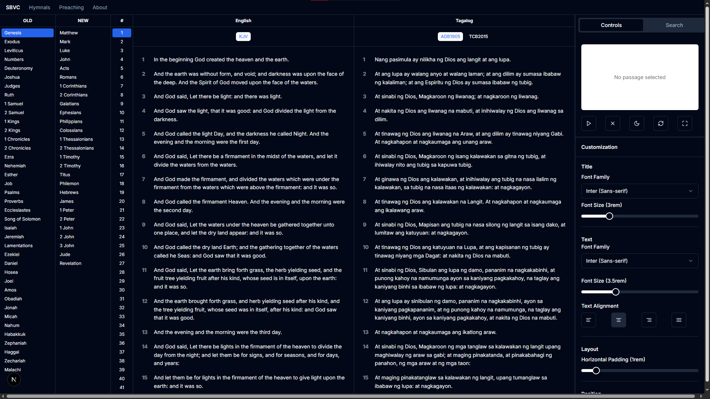

# SBVC - Show Bible Verse Controller

## Description

SBVC is a modern, web-based application designed to facilitate the presentation of Bible passages for church services, Bible studies, and other gatherings. Built with Next.js and TypeScript, it offers a clean, distraction-free viewing experience for the audience and a powerful, intuitive control panel for the operator.

 

The system uses a dual-window approach:
1.  **Controller Window**: A comprehensive dashboard for selecting books, chapters, and verses, searching for topics, customizing the look and feel, and previewing the output.
2.  **Presentation Window**: A separate, clean output screen designed for a secondary monitor or projector. It displays only the selected verse and reference, ensuring the audience remains focused on the text.

---

## Features

-   **Multi-Version Bible Support**: Seamlessly switch between English and Tagalog translations, including:
    -   King James Version (KJV)
    -   Ang Dating Biblia 1905 (ADB1905)
    -   The Contemporary Bible 2015 (TCB2015)
-   **Dual-Window Operation**: Manage content in one window while presenting it cleanly in another.
-   **Intuitive Navigation**: Easily browse through the Old and New Testaments with dedicated book and chapter lists.
-   **AI-Powered Search**: A powerful search tool to find verses by topic, keyword, or phrase across all available Bible versions.
-   **High-Performance Results**: Search results are rendered in a virtualized list, ensuring smooth scrolling and a responsive UI even with thousands of matches.
-   **Live Presentation Preview**: The controller includes a real-time, aspect-ratio-correct preview of the presentation screen.
-   **Advanced Customization**:
    -   **Typography**: Independently control the font family and font size for both the verse reference and the verse text.
    -   **Alignment**: Set text alignment to left, center, right, or justify.
    -   **Layout**: Adjust horizontal padding on the presentation screen to fit any display.
-   **Draggable Elements**: Directly manipulate the position of the verse title and text in the live preview by dragging them, allowing for precise on-the-fly layout adjustments.
-   **Theme Control**: Instantly switch the presentation screen between a `dark` and `light` theme.
-   **Fullscreen Control**: Remotely trigger fullscreen mode on the presentation window with the press of a button.
-   **Expandable Navigation**: A clean navigation bar with placeholder pages for future modules like Hymnals and Preaching.

---

## How The System Works

SBVC leverages modern web technologies to create a seamless experience. `localStorage` is used as a high-speed communication channel between the controller and presentation windows.

1.  **Verse Selection**: When the operator selects a verse in the `Controller` window, the passage data (reference, text, and selected version) is written to `localStorage`.
2.  **State Synchronization**: The `Presentation` window listens for `storage` events. When it detects a change to the passage data, it immediately updates its display with the new verse.
3.  **Customization**: Similarly, when the operator changes the theme, font sizes, or element positions, these settings are saved to `localStorage`. The `Presentation` window reads these settings and applies them in real-time.
4.  **Decoupled Windows**: This architecture allows the two windows to operate independently. The presentation window can be opened on a different monitor and will remain synchronized as long as it's running in the same browser profile.

---

## Changelog

*   **Initial Setup**: Project initialized with Next.js, React, and TypeScript.
*   **Core UI Implementation**: Created the main controller interface with panels for Old/New Testament books, chapters, and verse displays for English (KJV) and Tagalog (ADB, TCB) versions.
*   **Context API Integration**: Implemented React Context (`AppContext` and `BibleContext`) to manage global state for theme, passage selection, and Bible version management.
*   **Presentation Screen**: Developed the `/present` page, which listens for `localStorage` changes to display passages in a clean, focused view.
*   **Presentation Controls**: Added controls to open the presentation window, clear the screen, toggle themes, and trigger fullscreen mode.
*   **Advanced Customization**: Built a "Customization" tab with sliders and selectors for fonts, font sizes, alignment, and padding. Implemented draggable title and text elements in the preview and presentation screens.
*   **AI Search Feature**:
    -   Integrated a server-side search flow (`search-bible.ts`) that reads local JSON files for KJV, ADB, and TCB Bibles.
    -   Created a "Search" tab in the controller with an input to search for topics.
    -   Implemented a virtualized results list using `@tanstack/react-virtual` to handle a large number of search results without UI lag.
    -   Refined the virtualized list to support dynamic row heights, ensuring the full text of every verse is visible.
*   **UI/UX Refinements**:
    -   Standardized scrollbar appearance across the application.
    -   Adjusted component layouts for better usability, such as balancing the size of the search results and the notepad.
    -   Fixed bugs related to state synchronization and UI rendering.
*   **Navigation Structure**: Added a primary navigation bar with links to "SBVC," "Hymnals," "Preaching," and "About," and created placeholder pages for future expansion.

---

## Technologies Used

*   **Framework**: [Next.js](https://nextjs.org/) (with App Router)
*   **Language**: [TypeScript](https://www.typescriptlang.org/)
*   **UI Library**: [React](https://reactjs.org/)
*   **Styling**: [Tailwind CSS](https://tailwindcss.com/)
*   **UI Components**: [ShadCN UI](https://ui.shadcn.com/)
*   **Generative AI**: [Genkit](https://firebase.google.com/docs/genkit)
*   **Animation**: [Framer Motion](https://www.framer.com/motion/)
*   **UI Virtualization**: [@tanstack/react-virtual](https://tanstack.com/virtual)
*   **Icons**: [Lucide React](https://lucide.dev/)

---

## Getting Started

To get a local copy up and running, follow these simple steps.

### Prerequisites

*   Node.js (v18 or newer)
*   npm or yarn

### Installation

1.  Clone the repository:
    ```sh
    git clone https://github.com/Mejez6603/SBVC.git
    ```
2.  Navigate to the project directory:
    ```sh
    cd SBVC
    ```
3.  Install NPM packages:
    ```sh
    npm install
    ```

### Running the Development Server

To start the application in development mode, run:
```sh
npm run dev
```
Open [http://localhost:9002](http://localhost:9002) to view the application's home page. The controller panel can be accessed at [http://localhost:9002/controller](http://localhost:9002/controller).

---

## Deployment

The application is configured for easy deployment on modern hosting platforms that support Next.js, such as [Vercel](https://vercel.com/) or [Firebase App Hosting](https://firebase.google.com/docs/app-hosting). The `apphosting.yaml` file is included for Firebase deployments.

---

## Future Enhancements

-   **Hymnals Module**: A dedicated section for displaying lyrics for hymns and worship songs.
-   **Preaching Module**: A tool for creating and presenting sermon notes or outlines.
-   **Multi-Verse Selection**: Allow the operator to select and display a range of verses at once.
-   **Saved Lists**: Ability to save collections of verses or songs for a specific service or event.
-   **More Bible Versions**: Add support for additional translations.

---

## Acknowledgements

-   GOD
-   The developers of the many open-source libraries that made this project possible.
-   The communities providing access to the digital Bible texts.
-   Pastor Alberto M Mejes
-   SBBC
-   Mejez
-   Dean Ryan Cruz
-   Firelink


---

## License

This project is open-source and available for personal and community use. Please refer to the `LICENSE` file for more details.